<h2 align="left">Hi 👋! My name is Ishita.</h2>

I'm passionate about:

<ul>
  <li>💡 Exploring emerging technologies</li>
  <li>🌐 Full-stack development</li>
  <li>🛠️ Open-source contributions (GSSoC'25, OSCI'25)</li>
</ul>

---

<h3>Check out some of my projects</h3>

<h2>Eco_Chain</h2>

A blockchain powered AIML integrated waste classification and management system.

<h4 align="center">
  <a href="https://github.com/Ishita-190/Eco_Chain">Check it out</a>
</h4>

<h2>Briefix</h2>

An AI powered legal assistant with features like document analysis, legal procedures guidance, and an AI chatbot built using NLP frameworks.

<h4 align="center">
  <a href="https://github.com/Ishita-190/Briefix">Check it out</a>
</h4>

---

<h3 align="center">My GitHub Contributions</h3>

  

---

Thanks for visiting. Feel free to explore my repositories and drop a ⭐ if you find something useful.

---

<h3>Tech Stack</h3>

  
  
  
  
  
  
  
  
  

---

<h3>Connect with me</h3>

  
  
  

